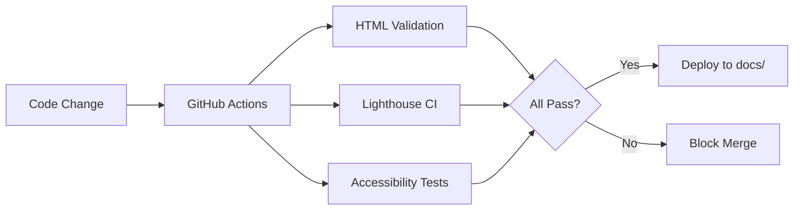
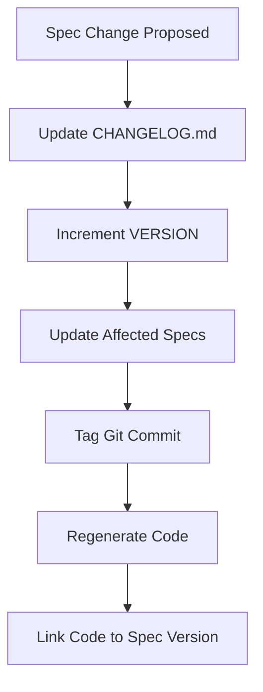
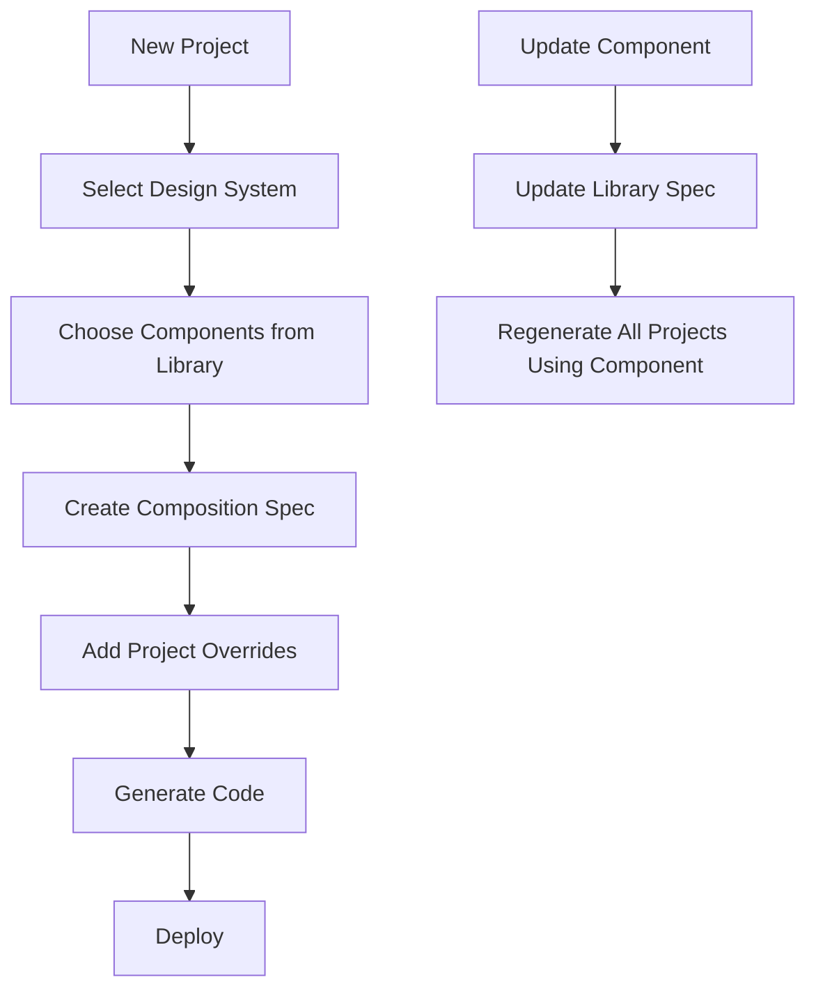

# Architecture Improvement Recommendations

## Current State Analysis

The project demonstrates excellent specification-driven development practices with a modular architecture. However, there are opportunities to enhance scalability, maintainability, and developer experience.

---

## Improvement 1: Automated Validation Pipeline

### Problem
Currently, validation criteria exist in [`tests/validation.md`](../tests/validation.md) but there's no automated enforcement. Manual testing is error-prone and time-consuming.

### Proposed Solution
Implement a **CI/CD validation pipeline** with automated checks.

### Architecture



### Implementation Structure

```
.github/
└── workflows/
    └── validate.yml          # GitHub Actions workflow

tests/
├── validation.md            # Human-readable criteria (existing)
├── lighthouse-config.json   # Lighthouse CI configuration
└── scripts/
    ├── validate-html.sh     # HTML5 validation
    ├── check-performance.js # Performance assertions
    └── test-accessibility.js # axe-core automated tests
```

### Benefits
- **Automated Quality Gates**: Prevent regressions before deployment
- **Consistent Standards**: Enforce validation criteria on every commit
- **Fast Feedback**: Developers know immediately if changes break requirements
- **Documentation Sync**: Tests serve as executable specifications

### Validation Checks
1. **HTML Validation**: W3C validator for semantic correctness
2. **Performance**: Lighthouse CI with thresholds from [`validation.md`](../tests/validation.md:3-7)
3. **Accessibility**: axe-core for WCAG 2.1 AA compliance
4. **File Size**: Assert `<50KB` requirement
5. **Color Contrast**: Automated contrast ratio checks

### Example GitHub Actions Workflow
```yaml
name: Validate Landing Page

on: [push, pull_request]

jobs:
  validate:
    runs-on: ubuntu-latest
    steps:
      - uses: actions/checkout@v3
      
      - name: Validate HTML
        run: npm run validate:html
      
      - name: Run Lighthouse CI
        uses: treosh/lighthouse-ci-action@v9
        with:
          configPath: './tests/lighthouse-config.json'
          
      - name: Test Accessibility
        run: npm run test:a11y
      
      - name: Check File Size
        run: |
          SIZE=$(wc -c < src/index.html)
          if [ $SIZE -gt 51200 ]; then
            echo "File size exceeds 50KB limit"
            exit 1
          fi
```

---

## Improvement 2: Specification Versioning & Change Management

### Problem
Specifications can change over time, but there's no formal versioning system. This makes it difficult to:
- Track which spec version generated which code
- Understand the evolution of requirements
- Roll back to previous spec versions
- Coordinate changes across multiple specs

### Proposed Solution
Implement a **specification versioning system** with change tracking.

### Architecture

```
specs/
├── VERSION                   # Current spec version (e.g., "2.1.0")
├── CHANGELOG.md             # Specification change history
├── project.md               # Now includes version metadata
└── .spec-versions/          # Version snapshots (optional)
    ├── v1.0.0/
    ├── v2.0.0/
    └── v2.1.0/
```

### Versioning Strategy

**Semantic Versioning for Specs**:
- **Major (X.0.0)**: Breaking changes (e.g., complete redesign)
- **Minor (1.X.0)**: New components or features
- **Patch (1.0.X)**: Bug fixes, clarifications, minor adjustments

### Enhanced Project Metadata

```markdown
# Project: Matt Small's Landing Page

**Version**: 2.1.0
**Last Updated**: 2025-12-18
**Generated Code**: src/index.html (v2.1.0)
**Status**: Production

## Version History
- v2.1.0 (2025-12-18): Added performance requirements
- v2.0.0 (2025-12-15): Migrated to modular structure
- v1.0.0 (2025-12-10): Initial monolithic specification
```

### Change Management Workflow



### Implementation Files

**`specs/VERSION`**:
```
2.1.0
```

**`specs/CHANGELOG.md`**:
```markdown
# Specification Changelog

## [2.1.0] - 2025-12-18
### Added
- Performance requirements in requirements/performance.md
- Core Web Vitals targets

### Changed
- Updated validation criteria with specific metrics

## [2.0.0] - 2025-12-15
### Changed
- **BREAKING**: Migrated from monolithic to modular structure
- Split page-spec.md into design-system/, components/, layouts/

### Added
- Design system tokens (colors, typography, spacing)
- Individual component specifications

## [1.0.0] - 2025-12-10
### Added
- Initial specification in page-spec.md
```

**Enhanced `src/index.html` metadata**:
```html
<!--
  Generated from specifications v2.1.0
  Spec commit: abc123def
  Generated: 2025-12-18T23:42:00Z
  Agent: Claude Sonnet 4
-->
```

### Benefits
- **Traceability**: Know which spec version generated which code
- **Change History**: Understand why specifications evolved
- **Rollback Capability**: Revert to previous spec versions if needed
- **Coordination**: Manage dependencies between spec changes
- **Documentation**: Clear communication of specification evolution

---

## Improvement 3: Component Library & Reusability Framework

### Problem
While the modular structure enables reusability in theory, there's no formal system for:
- Reusing components across multiple pages/projects
- Maintaining a component library
- Composing new pages from existing components
- Sharing design systems across projects

### Proposed Solution
Create a **component library framework** with reusable, composable specifications.

### Architecture

```
specs/
├── library/                 # Reusable component library
│   ├── README.md           # Library documentation
│   ├── components/         # Generic components
│   │   ├── hero-headline.md
│   │   ├── bio-paragraph.md
│   │   ├── badge-list.md
│   │   └── cta-button.md
│   └── design-systems/     # Reusable design systems
│       ├── professional-dark.md
│       └── minimal-light.md
│
├── projects/               # Project-specific implementations
│   ├── matt-small-landing/
│   │   ├── project.md
│   │   ├── composition.md  # How components are composed
│   │   └── overrides.md    # Project-specific customizations
│   └── future-project/
│
└── templates/              # Page templates
    ├── landing-page.md
    ├── portfolio.md
    └── contact-page.md
```

### Component Specification Format

**Generic Component** (`specs/library/components/cta-button.md`):
```markdown
# CTA Button Component

## Parameters
- `text`: Button text content
- `href`: Link destination
- `aria-label`: Accessibility label
- `width`: Button width (default: 300px)
- `height`: Button height (default: 100px)

## Design Tokens Required
- `colors.accent`: Button background
- `colors.primary`: Button text
- `spacing.lg`: Margin top

## Implementation
[Generic implementation template]

## Usage Example
See: projects/matt-small-landing/composition.md
```

**Project Composition** (`specs/projects/matt-small-landing/composition.md`):
```markdown
# Matt Small Landing Page Composition

## Design System
Base: library/design-systems/professional-dark.md

## Components Used
1. library/components/hero-headline.md
   - text: "Hi, I'm Matt, Principal Consultant of mattasmall.com"
   
2. library/components/bio-paragraph.md
   - content: [See bio.md]
   - max-width: 700px
   
3. library/components/badge-list.md
   - badges: [10 items from badges.md]
   
4. library/components/cta-button.md
   - text: "Talk AI and Cloud Optimization"
   - href: "mailto:mattasmall@gmail.com?subject=Consultation%20Request"
   - aria-label: "Contact Matt Small to discuss AI and Cloud Optimization"

## Layout
Template: library/templates/landing-page.md
```

### Reusability Workflow



### Benefits
- **Rapid Development**: Build new pages by composing existing components
- **Consistency**: Shared components ensure consistent UX across projects
- **Maintainability**: Update component once, affects all uses
- **Scalability**: Grow library as new components are created
- **Knowledge Sharing**: Component library serves as organizational knowledge base

### Migration Path

**Phase 1**: Extract current components to library
```
specs/components/headline.md → specs/library/components/hero-headline.md
specs/components/bio.md → specs/library/components/bio-paragraph.md
specs/components/badges.md → specs/library/components/badge-list.md
specs/components/cta-button.md → specs/library/components/cta-button.md
```

**Phase 2**: Create project-specific composition
```
specs/projects/matt-small-landing/composition.md (references library components)
```

**Phase 3**: Build new projects using library
```
specs/projects/new-project/composition.md (reuses existing components)
```

### Advanced Features

**Component Variants**:
```markdown
# CTA Button Component

## Variants
- primary: Gold background, navy text
- secondary: Navy background, gold text
- outline: Transparent background, gold border
```

**Design System Inheritance**:
```markdown
# Project Design System

Base: library/design-systems/professional-dark.md

Overrides:
- colors.accent: #ff6b00 (instead of #ffb900)
```

**Composition Validation**:
```javascript
// Validate that all required design tokens are provided
// Ensure component dependencies are satisfied
// Check for circular references
```

---

## Implementation Priority

### High Priority (Immediate Value)
1. **Automated Validation Pipeline** - Prevents regressions, saves manual testing time

### Medium Priority (Next Quarter)
2. **Specification Versioning** - Improves traceability and change management

### Long-term (Future Projects)
3. **Component Library** - Maximizes value when building multiple projects

---

## Success Metrics

### Improvement 1: Automated Validation
- **Metric**: Time to validate changes
- **Current**: ~30 minutes manual testing
- **Target**: <5 minutes automated pipeline
- **ROI**: 83% time savings per validation cycle

### Improvement 2: Specification Versioning
- **Metric**: Time to understand spec changes
- **Current**: ~15 minutes reviewing Git history
- **Target**: <2 minutes reading CHANGELOG
- **ROI**: Better change communication, faster onboarding

### Improvement 3: Component Library
- **Metric**: Time to build new landing page
- **Current**: 15 minutes (first page)
- **Target**: 5 minutes (subsequent pages using library)
- **ROI**: 67% time savings for new projects

---

## Conclusion

These three improvements build upon the project's strong foundation:

1. **Automated Validation** ensures quality at scale
2. **Specification Versioning** provides change management discipline
3. **Component Library** maximizes reusability across projects

Each improvement is independent and can be implemented incrementally, allowing the team to realize value progressively while maintaining the current workflow.
