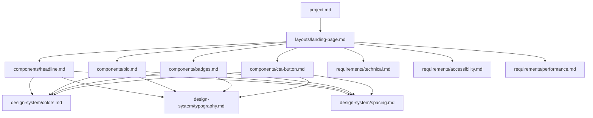

# Modular Specification Structure Proposal

## Current State Analysis

The existing [`page-spec.md`](../specs/page-spec.md) contains:
- Project metadata
- 4 component specifications (headline, bio, badges, CTA)
- Global style rules
- Technical requirements
- Success criteria

**Problem**: Monolithic structure makes it difficult to:
- Reuse components across projects
- Update individual components independently
- Maintain clear separation of concerns
- Scale to larger projects

## Proposed Modular Architecture

### Directory Structure

```
specs/
├── README.md                    # Overview and navigation
├── project.md                   # Project-level metadata
├── design-system/               # Reusable design tokens
│   ├── colors.md
│   ├── typography.md
│   └── spacing.md
├── components/                  # Individual component specs
│   ├── headline.md
│   ├── bio.md
│   ├── badges.md
│   └── cta-button.md
├── layouts/                     # Page composition specs
│   └── landing-page.md
└── requirements/                # Cross-cutting concerns
    ├── technical.md
    ├── accessibility.md
    └── performance.md
```

## Detailed File Breakdown

### 1. **`specs/project.md`** - Project Metadata
**Purpose**: High-level project information and context

**Contents**:
- Project name and description
- Target audience
- Business goals
- Key stakeholders
- Version/iteration tracking

**Example**:
```markdown
# Project: Matt Small's Landing Page

## Overview
A professional landing page for Matt Small, Principal Consultant

## Target Audience
- Potential enterprise clients
- Fortune 500 decision-makers
- Startup founders

## Business Goals
- Generate consultation inquiries
- Establish credibility
- Showcase expertise areas
```

---

### 2. **`specs/design-system/colors.md`** - Color Palette
**Purpose**: Centralized color definitions for consistency

**Contents**:
- Primary, secondary, accent colors
- Background colors
- Text colors
- State colors (hover, active, disabled)
- Semantic color mappings

**Example**:
```markdown
# Color Palette

## Brand Colors
- **Primary**: #313357 (Dark Navy)
- **Accent**: #ffb900 (Gold)
- **Text**: #C0C0C0 (Silver)

## Semantic Usage
- Background: Primary (#313357)
- CTA Button: Accent (#ffb900)
- Body Text: Text (#C0C0C0)
- Badge Background: #3a3d63
- Badge Border: rgba(255, 185, 0, 0.2)
```

---

### 3. **`specs/design-system/typography.md`** - Typography System
**Purpose**: Font specifications and text styling rules

**Contents**:
- Font families
- Font sizes (desktop/mobile)
- Font weights
- Line heights
- Text alignment rules

**Example**:
```markdown
# Typography System

## Font Family
- Primary: System font stack
  `-apple-system, BlinkMacSystemFont, 'Segoe UI', Roboto, Oxygen, Ubuntu, Cantarell, sans-serif`

## Font Scales

### Desktop
- Headline: 32px / Bold (700)
- Body: 16px / Regular (400)
- Badge: 12px / Regular (400)
- CTA: 18px / Semi-bold (600)

### Mobile (≤768px)
- Headline: 26px / Bold (700)
- Body: 14px / Regular (400)
- Badge: 12px / Regular (400)
- CTA: 18px / Semi-bold (600)

## Line Heights
- Headline: 1.3
- Body: 1.8
- Default: 1.6
```

---

### 4. **`specs/design-system/spacing.md`** - Spacing System
**Purpose**: Consistent spacing and layout measurements

**Contents**:
- Margin scale
- Padding scale
- Gap values
- Responsive adjustments

**Example**:
```markdown
# Spacing System

## Spacing Scale
- xs: 8px
- sm: 16px
- md: 24px
- lg: 32px
- xl: 40px

## Component Spacing
- Headline margin-bottom: 16px (sm)
- Bio margin-bottom: 16px (sm)
- Badges margin-top: 24px (md)
- Badges gap: 8px (xs)
- CTA margin-top: 32px (lg)

## Badge Padding
- Vertical: 8px (xs)
- Horizontal: 16px (sm)
```

---

### 5. **`specs/components/headline.md`** - Headline Component
**Purpose**: Specification for the main headline

**Contents**:
- Content requirements
- Typography reference
- Spacing reference
- Responsive behavior

**Example**:
```markdown
# Headline Component

## Content
"Hi, I'm Matt, Principal Consultant of mattasmall.com"

## Typography
- Font Size: See [typography.md](../design-system/typography.md#headline)
- Font Weight: Bold (700)
- Alignment: Centered

## Spacing
- Margin Bottom: 16px (sm)

## Responsive Behavior
- Desktop: 32px
- Mobile (≤768px): 26px

## Accessibility
- Semantic: `<h1>` element
- Color contrast: 4.5:1 minimum
```

---

### 6. **`specs/components/bio.md`** - Bio Component
**Purpose**: Specification for the biography paragraph

**Contents**:
- Content guidelines (word count, tone, themes)
- Typography reference
- Spacing reference
- Content structure

**Example**:
```markdown
# Bio Component

## Content Requirements
- Length: ~150 words
- Tone: Confident, results-focused, transformational
- Opening Theme: "Catalyst" for systemic change

## Key Points to Include
- 15+ years experience
- Fortune 500 and startups
- Focus areas:
  * FinOps
  * Enterprise AI adoption and governance
  * Cloud strategy

## Typography
- Font Size: See [typography.md](../design-system/typography.md#body)
- Alignment: Centered
- Max Width: 700px

## Spacing
- Margin Bottom: 16px (sm)
- Line Height: 1.8

## Accessibility
- Semantic: `<p>` element with `.bio` class
```

---

### 7. **`specs/components/badges.md`** - Badges Component
**Purpose**: Specification for credibility badges

**Contents**:
- Badge list
- Layout specifications
- Styling details
- Responsive behavior

**Example**:
```markdown
# Badges Component

## Badge List
1. AWS Solutions Architect
2. FinOps Certified
3. Kwaai.ai Board Member
4. 15+ Years Cloud Platforms
5. RightScale Pioneer
6. Infrastructure-as-Code Expert
7. Enterprise AI Governance
8. Pulumi Alumni
9. Customer Success Leader
10. Strategic GTM Advisor

## Layout
- Display: Horizontal row
- Alignment: Centered
- Wrap: Yes (on mobile)
- Gap: 8px (xs)

## Styling
- Background: #3a3d63
- Text Color: #C0C0C0 (Silver)
- Border: 1px solid rgba(255, 185, 0, 0.2)
- Border Radius: 20px (pill-shaped)
- Padding: 8px vertical, 16px horizontal
- Font Size: 12px

## Spacing
- Margin Top: 24px (md)
- Margin Bottom: 24px (md)

## Accessibility
- Container: `role="list"` with `aria-label="Professional credentials and expertise"`
- Individual badges: `role="listitem"`
```

---

### 8. **`specs/components/cta-button.md`** - CTA Button Component
**Purpose**: Specification for the call-to-action button

**Contents**:
- Button text
- Dimensions
- Colors and states
- Interaction behavior
- Link destination

**Example**:
```markdown
# CTA Button Component

## Content
"Talk AI and Cloud Optimization"

## Dimensions
- Width: 300px (280px on mobile)
- Height: 100px (90px on mobile)
- Shape: Oval (border-radius: 50px)

## Colors
- Background: #ffb900 (Gold)
- Text: #313357 (Dark Navy)
- Shadow: 0 4px 6px rgba(0, 0, 0, 0.2)

## States
- **Hover**: 
  * Scale: 1.05
  * Shadow: 0 6px 12px rgba(0, 0, 0, 0.3)
- **Active**: Scale: 1.02
- **Focus**: 3px solid #ffb900 outline, 4px offset

## Typography
- Font Size: 18px (all breakpoints)
- Font Weight: 600 (semi-bold)

## Link
- Destination: `mailto:mattasmall@gmail.com?subject=Consultation%20Request`
- Element: `<a>` with `role="button"`

## Accessibility
- ARIA Label: "Contact Matt Small to discuss AI and Cloud Optimization"
- Keyboard navigable
- Reduced motion support: `@media (prefers-reduced-motion: reduce)`

## Responsive
- Mobile (≤480px): Width: 100%, max-width: 280px
```

---

### 9. **`specs/layouts/landing-page.md`** - Landing Page Layout
**Purpose**: Composition and arrangement of components

**Contents**:
- Component order
- Container specifications
- Vertical rhythm
- Responsive behavior

**Example**:
```markdown
# Landing Page Layout

## Component Order
1. [Headline](../components/headline.md)
2. [Bio](../components/bio.md)
3. [Badges](../components/badges.md)
4. [CTA Button](../components/cta-button.md)

## Container
- Element: `<main role="main">`
- Max Width: 800px
- Alignment: Centered
- Padding: 40px 20px (desktop), 20px 15px (mobile)

## Page Layout
- Display: Flexbox
- Direction: Column
- Justify: Center
- Align: Center
- Min Height: 100vh

## Background
- Color: See [colors.md](../design-system/colors.md#primary)

## Responsive Breakpoints
- Desktop: Default
- Tablet: ≤768px
- Mobile: ≤480px
```

---

### 10. **`specs/requirements/technical.md`** - Technical Requirements
**Purpose**: Technical constraints and implementation details

**Contents**:
- File structure requirements
- Dependency constraints
- Performance targets
- Browser compatibility

**Example**:
```markdown
# Technical Requirements

## File Structure
- Format: Single HTML file with inline CSS
- No external dependencies
- No JavaScript required

## HTML Standards
- Semantic HTML5
- Valid markup
- Proper document structure

## Performance
- Target file size: <50KB
- Load time: <3 seconds
- No external requests

## Browser Support
- Modern browsers (Chrome, Firefox, Safari, Edge)
- Mobile browsers (iOS Safari, Chrome Mobile)

## Code Quality
- Clean, readable code
- Commented sections
- Consistent formatting
```

---

### 11. **`specs/requirements/accessibility.md`** - Accessibility Requirements
**Purpose**: WCAG compliance and accessibility standards

**Contents**:
- WCAG level target
- Specific requirements
- ARIA usage
- Keyboard navigation

**Example**:
```markdown
# Accessibility Requirements

## Standards
- Target: WCAG 2.1 Level AA
- Minimum contrast ratio: 4.5:1

## Semantic HTML
- Proper heading hierarchy
- Semantic elements (`<main>`, `<h1>`, `<p>`)
- Meaningful structure

## ARIA
- ARIA labels where needed
- Role attributes for custom components
- Descriptive labels for interactive elements

## Keyboard Navigation
- All interactive elements keyboard accessible
- Visible focus indicators
- Logical tab order

## Motion
- Respect `prefers-reduced-motion`
- No auto-playing animations
- Smooth, purposeful transitions
```

---

### 12. **`specs/requirements/performance.md`** - Performance Requirements
**Purpose**: Performance targets and optimization guidelines

**Contents**:
- Load time targets
- File size limits
- Optimization strategies

**Example**:
```markdown
# Performance Requirements

## Targets
- Initial load: <3 seconds
- File size: <50KB
- Time to interactive: <2 seconds

## Optimization
- Inline CSS (no external requests)
- Minimal DOM complexity
- Efficient CSS selectors
- No render-blocking resources

## Metrics
- First Contentful Paint: <1.5s
- Largest Contentful Paint: <2.5s
- Cumulative Layout Shift: <0.1
```

---

## Benefits of Modular Structure

### 1. **Reusability**
- Design system tokens can be reused across multiple pages
- Components can be referenced in different layouts
- Consistent patterns across projects

### 2. **Maintainability**
- Update colors in one place, affects all components
- Clear ownership of each specification
- Easier to review and approve changes

### 3. **Scalability**
- Add new components without modifying existing specs
- Create new layouts by composing existing components
- Build a library of reusable specifications

### 4. **Clarity**
- Each file has a single, clear purpose
- Easier to find specific information
- Reduced cognitive load when reading specs

### 5. **Collaboration**
- Multiple people can work on different specs simultaneously
- Clear boundaries reduce merge conflicts
- Easier to assign ownership and review

### 6. **Version Control**
- Granular change tracking
- Easier to understand what changed and why
- Better Git history and blame information

## Migration Strategy

### Phase 1: Create Design System
1. Extract colors to `design-system/colors.md`
2. Extract typography to `design-system/typography.md`
3. Extract spacing to `design-system/spacing.md`

### Phase 2: Create Component Specs
1. Create `components/headline.md`
2. Create `components/bio.md`
3. Create `components/badges.md`
4. Create `components/cta-button.md`

### Phase 3: Create Supporting Specs
1. Create `layouts/landing-page.md`
2. Create `requirements/technical.md`
3. Create `requirements/accessibility.md`
4. Create `requirements/performance.md`
5. Create `project.md`

### Phase 4: Update Navigation
1. Update `specs/README.md` with new structure
2. Add cross-references between files
3. Archive or remove old `page-spec.md`

## Cross-Referencing Pattern

Use relative links to reference other specs:

```markdown
## Colors
See [colors.md](../design-system/colors.md) for the complete color palette.

## Typography
Font sizes defined in [typography.md](../design-system/typography.md#font-scales).
```

## Dependency Graph



## Example: How an Agent Would Use This

### Scenario: Build the landing page

1. **Start**: Read `project.md` for context
2. **Layout**: Read `layouts/landing-page.md` for structure
3. **Design System**: Read `design-system/*.md` for tokens
4. **Components**: Read each component spec in order
5. **Requirements**: Read `requirements/*.md` for constraints
6. **Generate**: Create HTML/CSS following all specs
7. **Validate**: Check against success criteria

### Scenario: Update button color

1. **Locate**: Find `design-system/colors.md`
2. **Update**: Change accent color value
3. **Impact**: Automatically affects `components/cta-button.md`
4. **Regenerate**: Agent rebuilds affected components

## Recommendations

### For This Project
Start with a **hybrid approach**:
- Keep `page-spec.md` as the "source of truth"
- Create modular specs that reference it
- Gradually migrate content to modular structure

### For Future Projects
- Start with modular structure from day one
- Build design system first
- Create component library
- Compose pages from components

### File Naming Conventions
- Use kebab-case: `cta-button.md`, not `CTAButton.md`
- Be descriptive: `landing-page.md`, not `page1.md`
- Group by type: `components/`, `layouts/`, `requirements/`

### Documentation Standards
- Each file should have a clear "Purpose" section
- Include examples where helpful
- Use cross-references liberally
- Keep files focused and concise (aim for <200 lines)
